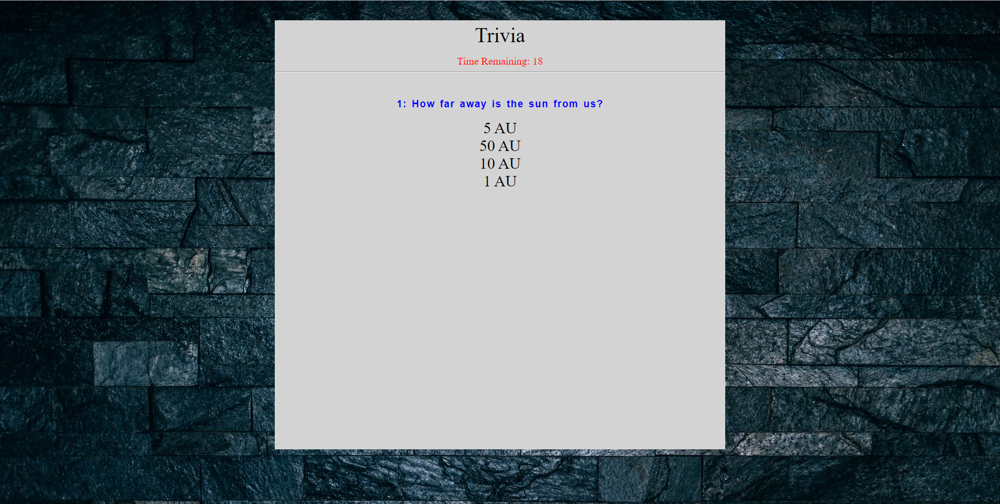

# TriviaGame

## Description: You answer some astronomy question with a timer.

## How it is organaize:
### You click on an answer
### you are responded if the answer was right or wrong
### You are given a score in the end

## How to run the app:
### 1. Git clone this repo
### 2. open index.html in your browser

### You can view the app here
### https://armjim14.github.io/TriviaGame/

## Home page

